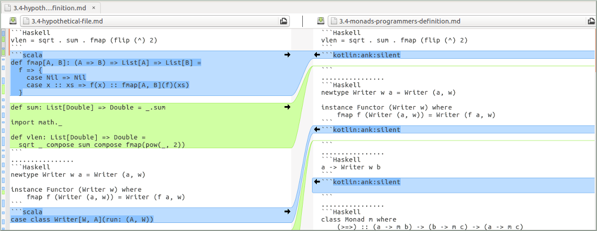

### Kotlin sample code for Bartosz Milewski's [Category Theory for Programmers](https://bartoszmilewski.com/2014/10/28/category-theory-for-programmers-the-preface/)
[](https://travis-ci.com/arrow-kt/Category-Theory-for-Programmers.kt)

## Contributing
Contributions (PR, review, issues) are welcome!
If you are interested, please indicate that you are working on in the respective issues. [You can find the issues for each chapter here here.](https://github.com/arrow-kt/Category-Theory-for-Programmers.kt/issues). Feel free to claim an issue you want to work on by adding a comment. Someone will then move it to `In progress` in the [project board](https://github.com/arrow-kt/Category-Theory-for-Programmers.kt/projects/1)

We discuss Arrow and development of FP in general in Kotlin in the
[Kotlin Community Slack](https://slack.kotlinlang.org) in the [arrow](https://kotlinlang.slack.com/messages/C5UPMM0A0) and [arrow-contributors](https://kotlinlang.slack.com/messages/C8UK6RTHU) channels. 

Build the project with:

```bash
./gradlew runAnk
```

## Spaces and indentation

Please use 2 spaces to indent your code.

## Type-check your code

Use **\`\`\`kotlin:ank:silent\`\`\`** for code that is compilable, use **\`\`\`kotlin\`\`\`** otherwise.

Use a line of `.............` to separate between code examples. 

### functions vs. methods

If it's a "standalone" function, use the function syntax, i.e.
```kotlin
val f: (A) -> B
```

If it is inside an interface or class, use the method, i.e.

```kotlin
fun f(a: A) : B
```

### Λnk

- The Docs for [Λnk](https://github.com/arrow-kt/arrow/tree/master/modules/ank) without ank:playground 

- If you define / redefine type classes please define them within a playground environment.
```markdown
```kotlin:ank:playground
import arrow.core.ForListK
import arrow.core.ListK
import arrow.Kind
import arrow.core.fix
import arrow.typeclasses.Functor

interface ListKFunctor : Functor<ForListK> {
    override fun <A, B> Kind<ForListK, A>.map(f: (A) -> B): ListK<B> =
        fix().map(f)
}
```... 
```
[Playground Docs](https://github.com/arrow-kt/arrow-playground).
But for now a basic set-up as the snippet above is sufficient. Remember that ank:playground wont make the code snippet global for other snippets.

- In some instances (in the context of coroutine examples) Λnk won't process very long (over ~160 lines) md files. Split them up into < chapter >-Part1.md , < chapter >-Part2.md

- Debug with (optionally add the --stacktrace)
```bash
   ./gradlew runAnk
```

## Initial drafts :tada:

Now there are initial drafts for the missing sections!

It's only necessary to add the translation in Kotlin after the existing snippets in Haskell.

Pick the draft from `drafts` directory and move it to `src/main/ank` directory to be considered when building the project.

Even the hypothetical file for Scala is included as a help in `drafts/scala` so it's possible to add the translation in Kotlin with more information:



Please, note that each snippet has **\`\`\`kotlin:ank:silent\`\`\`** by default. Change it to just **\`\`\`kotlin\`\`\`** or **\`\`\`kotlin:ank:playground\`\`\`** for different purposes according to this documentation.

## License 


This work is licensed under a [Creative Commons Attribution 4.0 International License.](https://creativecommons.org/licenses/by/4.0/)
